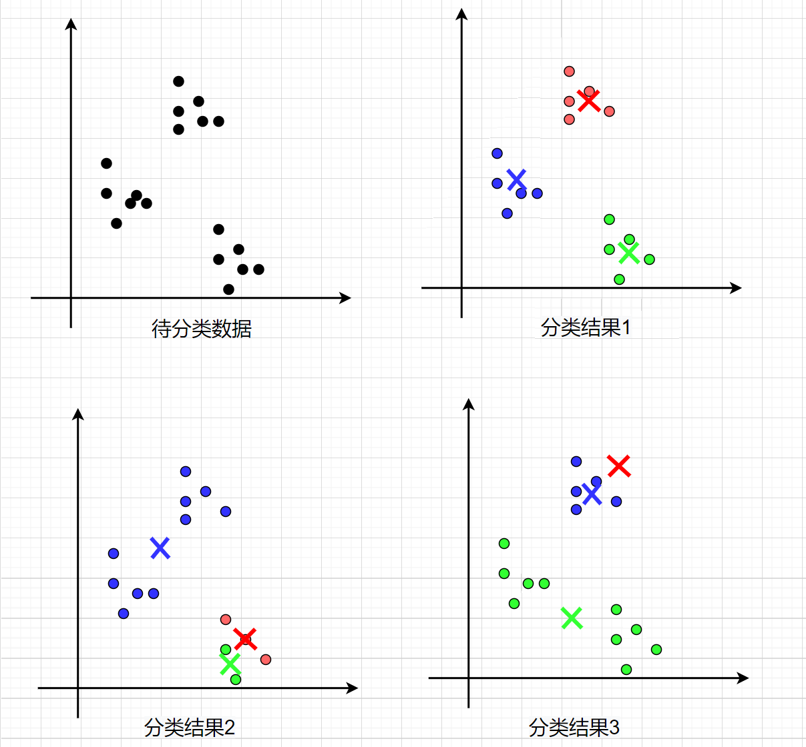

# 								K-means算法介绍

[TOC]


## 1.Kmeans

​		                  

### 1.1 简介

​		K-means算法是一种无监督的聚类算法，根据给定的簇数K，将输入的数据集合分成K簇。它实现起来比较简单，聚类效果也不错，因此应用很广泛。这里介绍了基础的K-means算法，以及它的两个优化方法：

K-means++和Mini Bacth K-means。

### 1.2 基础K-means算法步骤

a）从给定的数据集中随机选取K个点作为聚类中心

b）计算数据集中每个点到各个聚类中心的距离，然后将该点分配至其距离最近的聚类中心所在类

c）更新聚类中心。计算每类所包含数据点的平均值，并作为该类新的聚类中心

d）重复(b)(c)步骤，直至收敛（达到最大迭代次数或聚类中心不再变化）

### 1.3 K-Means++与Mini Batch K-Means

​	基础的K-means算法存在一个问题，就是当数据量比较大时，每次更新聚类中心需要大量的计算（(b)(c)两步），并且想要得到比较好的分类效果，需要迭代非常多次。

#### 1.3.1 K-means++

​		K-means++是一种优化初始聚类中心选取的策略。初始随机选取的聚类中心对聚类效果和运行时间都有很大的影响，聚类中心选取不好，不仅会导致较长的训练时间，还可能得到较差的局部最优解。如下图所示，分类结果①是效果较好的，但若是初始聚类中心选取的不好，也可能得到分类结果②和③。K-means++的基本思想是：聚类中心之间的距离一般来说相对较大，所以尽量选取相隔远的点作为聚类中心。这样选择有利于减少迭代次数，同时得到较好的局部最优解。



K-means++的步骤区别就在于初始聚类中心的选取：
		a）从数据集中随机选取一个聚类中心

​		b）计算数据集中每个点到距离其最近的聚类中心的距离L

​		c）抽取一个点作为新的聚类中心，L值越大被抽中的概率越大（转盘算法）

​		d）重复(b)(c)步骤，直至抽满K个聚类中心				

```
转盘算法:
	计算每个点到聚类中心的距离，将其计算结果组成数组，然后使用随机函数随机一个值，根据随机值结果选取新的聚类中心。
	例：点集合为a,b,c,d。a点为聚类中心，b,c,d点到a点的距离分别是1,2,4。那么可以得到如下数组
```


```
那么随机函数结果为1，则选择b点为新的聚类中心；随机函数结果为3，则选择c点作为新的聚类中心，因为3处于c点的区域；同理随机函数结果值落在4~7之间，则选择d点为新的聚类中心
```

#### 1.3.2 Mini batch K-means

​		K-means++有利于减少训练的迭代次数，但是当数据量很大时，每次迭代中的计算量依旧巨大。Mini Bacth K-means是针对计算量的优化，该算法在更新聚类中心时只使用小规模的数据子集，从而降低计算量，加快训练。Mini Bacth K-means产生的结果效果只是略差于标准K-Means算法。

a）选取K个聚类中心

b）随机抽取部分数据（不放回抽取），计算得到每个点所属簇类

c）更新聚类中心，这里只用抽取出来的部分数据

d）重复(b)(c)步骤，直至收敛（达到最大迭代次数或聚类中心不再变化）

### 1.4 K值选取

​		k值的选取对K-means训练结果影响很大,但对于如何选取K值并没有什么好的办法。一般是通过经验，或者是观察可视化的图，亦或是通过肘部法来选取。

​		肘部法，即根据不同K选值下，将K-means模型的损失值绘制成图，选取拐角处的K值最优。很多时候肘部法也不起作用，因为不存在明显的拐点。

